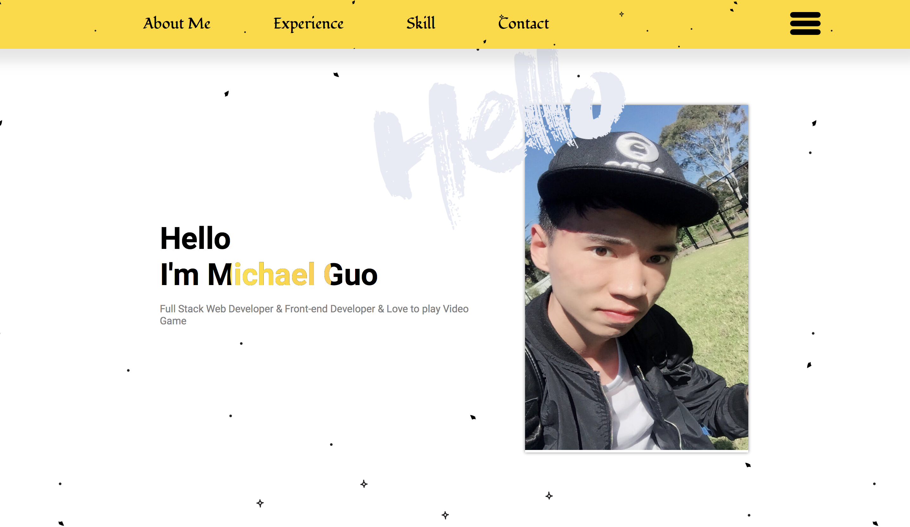
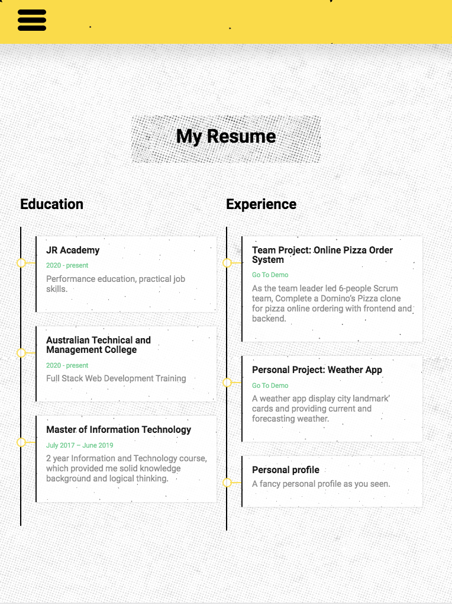
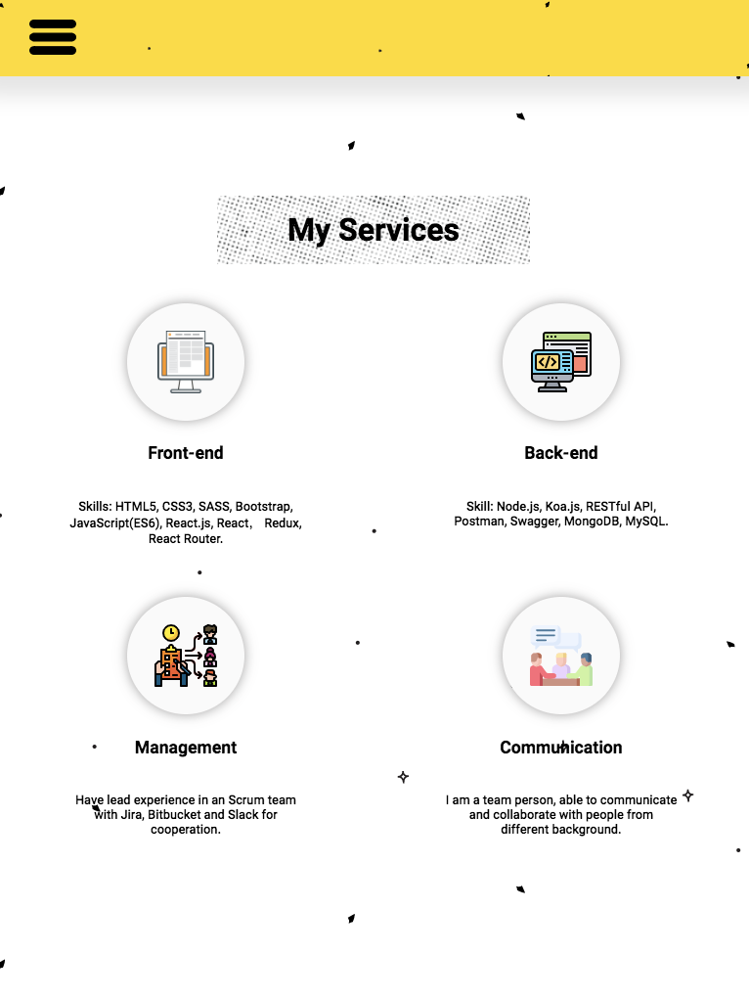
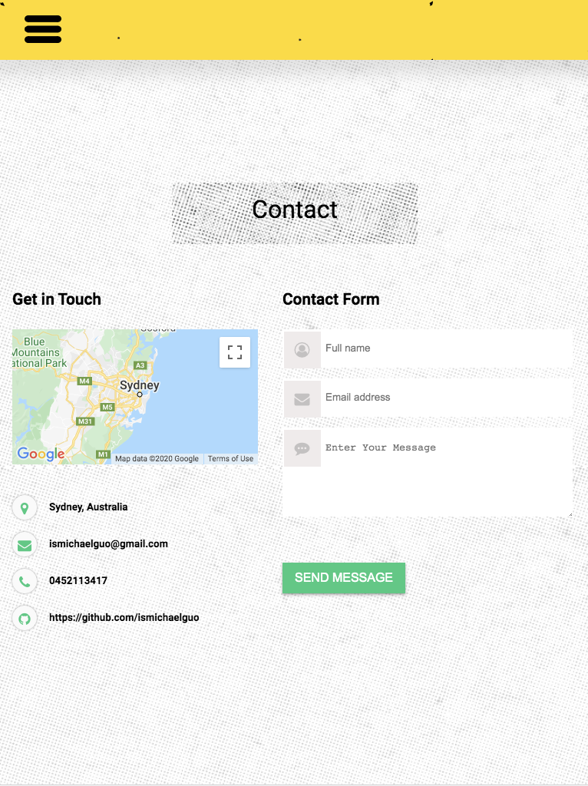

<p align="center">
  <a href="" rel="noopener">
 </a>
</p>

<h3 align="center">Personal Profile</h3>

<div align="center">

[]()
[](http://opensource.org/licenses/MIT)
</div>

---

<p align="center"> 🍔 My Personal Website built with <b>HTML5</b>, <b>CSS3</b>, <b>Javascript</b> and <b>SASS</b>
<br>
<a href="http://ismichaelguo.com">Go to the profile</a>
</p>

## 📝 Table of Contents

- [Inspiration](#inspiration)
- [About](#about)
- [Demo](#demo)
- [How it works](#working)
- [APIs](#apis)
- [Getting Started](#getting_started)
- [Authors](#authors)

## 🧐 Inspiration <a name = "inspiration"></a>

I used to have a previous personal website, but recently I am not satisfy with it. Therefore, I try my best to deliver a personal profile with nice UI and added some functionalities which I learn from a project I am currently working on. 

## 🧐 about <a name = "about"></a>

My personal profile is currently deployed on aws s3 with my own domain. It is supported to display on every device by the media query. By the way it really has a good look, lol.

On iPad:
<p>
</a>
</a>
</a>
</a>

</p>

## 🎥 Go To Profile <a name = "demo"></a>
- Profile URL: http://ismichaelguo.com

## 💭 How it works <a name = "working"></a>

- This Profile is based on `HTML5`, `CSS3`, and `Javascript`;
-`SASS` is used to write clear and maintainable css structure.
- `Eslint` used to inspect the problematic code;
- `Google Map API` is used to display my location;
- Followed the principle of Thinking to write maintainable and readable code.


## 🏁 Getting Started <a name = "getting_started"></a>

These instructions will get you a copy of the project up and running on your local machine for development and testing purposes.

### 🔧 Prerequisites

What things you need to install the software and how to install them.

```
Node
React
```

### ⛏️ Installing

At root folder
```
npm install
npm start
```

## ✍️ Authors <a name = "authors"></a>

- [@Michael Guo](https://github.com/ismichaelguo) - Idea & Initial work
